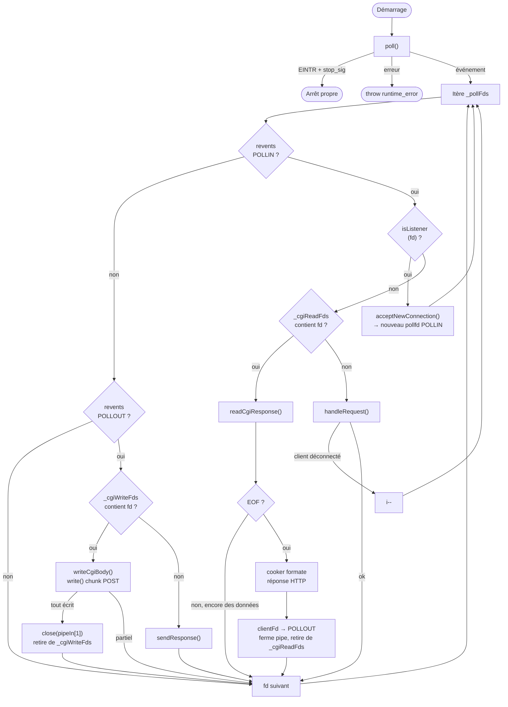

# WebServ — Flow algorithmique

## 1. Boucle principale `run()`



---

## 2. Cycle de vie d'un client

```mermaid
stateDiagram-v2
    [*] --> READING : accept&lpar;&rpar; → POLLIN

    READING --> READING : readClientData&lpar;&rpar;\nrequête incomplète

    READING --> STATIC : requête complète\nisCgi = false\n→ POLLOUT

    READING --> CGI_FORK : requête complète\nisCgi = true\n→ CgiHandler&lpar;&rpar;

    CGI_FORK --> CGI_WRITE : POST avec body\npipeIn&lbrack;1&rbrack; → POLLOUT

    CGI_FORK --> CGI_WAIT : GET\nclose&lpar;pipeIn&lbrack;1&rbrack;&rpar; immédiat\npipeOut&lbrack;0&rbrack; → POLLIN

    CGI_WRITE --> CGI_WAIT : body entièrement écrit\nclose&lpar;pipeIn&lbrack;1&rbrack;&rpar;\npipeOut&lbrack;0&rbrack; → POLLIN

    CGI_WAIT --> STATIC : EOF sur pipe\ncooker formate HTTP\nclientFd → POLLOUT

    STATIC --> [*] : sendResponse&lpar;&rpar;\nkeep-alive → READING\nclose → closeConnection&lpar;&rpar;
```

---

## 3. CgiHandler&lpar;&rpar; — ce qu'il fait et ne fait PAS

```mermaid
flowchart TD
    IN([Appelé par le cooker\navec DataCgi]) --> PIPES[pipe&lpar;pipeIn&rpar;\npipe&lpar;pipeOut&rpar;]
    PIPES --> ENVP[Construit envpData\nvector&lt;string&gt;\npuis envp vector&lt;char*&gt;]
    ENVP --> FORK[fork&lpar;&rpar;]

    FORK -->|pid == 0\nCHILD| DUP[dup2 pipeIn&lbrack;0&rbrack; → STDIN\ndup2 pipeOut&lbrack;1&rbrack; → STDOUT\nferme tous les pipes]
    DUP --> EXEC[execve&lpar;interpreter, argv, envp&rpar;]
    EXEC --> EXIT[exit&lpar;1&rpar; si échec]

    FORK -->|pid > 0\nPARENT| CLOSE_IN0[close&lpar;pipeIn&lbrack;0&rbrack;&rpar;\nclose&lpar;pipeOut&lbrack;1&rbrack;&rpar;]
    CLOSE_IN0 --> RETURN[retourne CgiPipes\n{ readFd=pipeOut&lbrack;0&rbrack;,\n  writeFd=pipeIn&lbrack;1&rbrack;,\n  pid }]

    RETURN --> NOTE["⚠ NE PAS write&lpar;&rpar; ici\nNE PAS read&lpar;&rpar; ici\nTout passe par poll&lpar;&rpar;"]
```

---

## 4. Structures de données clés dans ServerManager

| Structure | Type | Rôle |
|---|---|---|
| `_pollFds` | `vector<pollfd>` | Tous les fds surveillés par poll() |
| `_clients` | `map<int,Client>` | Clients actifs, clé = clientFd |
| `_listeners` | `vector<TcpListener*>` | Sockets d'écoute |
| `_cgiReadFds` | `map<int,int>` | pipeOut[0] → clientFd |
| `_cgiWriteFds` | `map<int,int>` | pipeIn[1] → clientFd (POST) |

---

## 5. Règles invariantes

- `read()` / `write()` **uniquement** après signal `poll()`
- `fork()` **uniquement** dans `CgiHandler()`
- `recv()` / `send()` **uniquement** sur sockets client (jamais sur pipes)
- `errno` vérifié **uniquement** après `poll()`, jamais après `recv()`/`send()`
- `_pollFds` modifié → décrémenter `i` si suppression en cours d'itération
